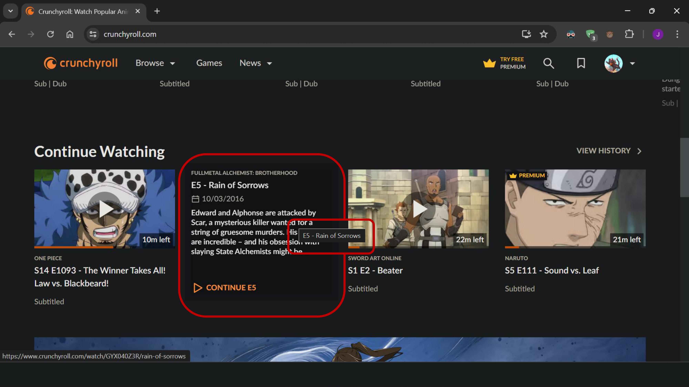
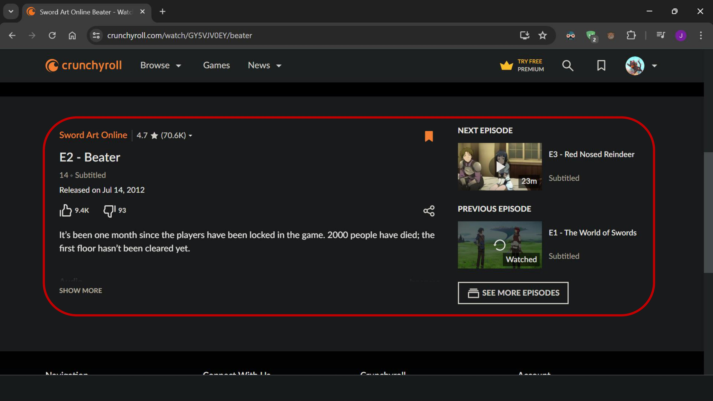
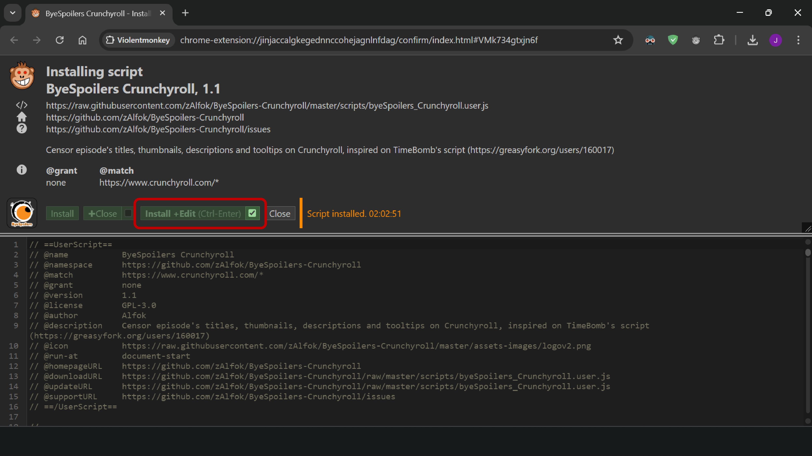

# ByeSpoilers - Crunchyroll
Userscript that allows you to relax and avoid any spoilers from thumbnails, titles, etc on Crunchyroll. Inspired on TimeBomb's script (https://greasyfork.org/users/160017).  

    <picture>
        
    </picture>

## 📖 Overview
If you use Crunchyroll and are fed up with episode titles or thumbnails (totally not spoiler-ish wink wink) revealing what's going to happen (probably the most crucial part wink wink), or if you're scrolling through the episode list (trusting that no title or thumbnail will spoil a character's death wink wink) only to find out someone dies N episodes later, then this script is your new best friend! Let's break down what this script censors and how it works.

## 📷 Screenshots

| Crunchyroll WITHOUT ByeSpoilers | Crunchyroll WITH ByeSpoilers |
|--------------------------------------------|-----------------------------------------|
|  |  |
|  |  |
|  |  |
|  |  |
|  |  |
|  |  |

## 📂 Installation

In order to use the script you should install a script-manager like Violentmonkey, Tampermonkey, etc. To do this you can search on the extension store of your browser:

 
   
     
   
 

 
   
     
   
 

 
Then you have to install ByeSpoilers Script: 
  
To do that make sure to click "Install + Edit" so you can modify the USER_CONFIG according to your preferences (if you'd like to)
  

    <picture>
        
    </picture>

 
After that, make sure to mark the checkbox "Allow edits," change the USER_CONFIG settings by toggling true or false for each feature, and then click the "Save" button (or press Ctrl + S) to apply the changes. <b>After each time you save the script, you must refresh Crunchyroll (if it was open)</b> to see the updates.  
<em>⚠️ NOTICE THAT, AS STATED NEXT TO THE ALLOW EDITS CHECKBOX, ANY CHANGES THAT YOU MAKE WILL BE LOST IF THE SCRIPT IS UPDATED SO YOU'LL HAVE TO SET YOUR PREFERENCES AGAIN</em>
  

    <picture>
        
    </picture>

## ⭐ Information and features
- <b>What will it protect you from?</b>  
Spoilers sneaking up like ninjas in the following pages:
    - /home: Continue Watching Grid, Watchlist Grid (Hover),
    - /watchlist: Grid of Episodes (Hover)
    - /history: Grid of Episodes
    - /series: Last Episode, Grid of Episodes
    - /watch: Info wrapper, Next/Previous Episode, See More Episodes (Side and PopUp)

- <b>How’s this spoiler-shielding sorcery supposed to work?</b> 
Since spoilers can come from all sorts of places and in all sorts of forms, fortunately, we just have to focus on 6 things: thumbnails, titles (on the site and the tab), descriptions, URL's and tooltips (when you keep your mouse over an element and it displays like a mini-mini-popup). So the script has a initial configuration section in which you can choose the level of censorship. You will be allowed to choose to:
    - Blur episode's thumbnails (default enabled): Notice that not all thumbnails are episode-related so just those have blur.
    - Blur episode's titles (default disabled): Notices that this will blur the entire title element, so you'll not be able to see the episode number either.
    - Blur episode's descriptions (defalut enabled): Just blurs episode-related descriptions...
    - Modify episode's titles (default enabled): It transforms the '((S#) E# - )Episode Title' pattern into '((S#) E# - )[Title Censored]'. In some elements, the season and episode numbers are not part of the title, which is why they are in parentheses. This is applied to page content, tooltips, URLs, and the browser tab.
    - *Hide Premium Trial-related stuff (default disabled): This hides the banner (on /watch pages), the nav icon (on the top bar), and the menu button (inside the drop-down menu). Disabled by default since it's not the main purpose of the script, but might be useful to some people.

    - In order to choose which things censor, just change the <em>USER_CONFIG</em> (true/false).
    
- <b>Which languages does it support?</b> 
Based on Crunchyroll's language list in configuration.

- <b>Does it works 100% of time?</b> 
Wish to say yes... but actually don't really know. It has worked 99% of the time in my tests, but it's challenging due to the dynamic way Crunchyroll structures their site. If something goes wrong, just give the page a refresh. The script is supposed to blur the entire page when it first loads (cause that's when things are the trickiest, with so much loading at once) until everything that needs to be censored is covered.

- <b>How did it start?</b> 
I was tired of being spoiled mainly due to titles and began searching for extensions or scripts but had little luck until I found TimeBomb's script, which didn’t work well, probably due to updates on Crunchyroll’s site. So, I decided to create my own based on the latest changes of the site (around July 2024). I’m not a web developer, or even a developer; this is just a hobby, so that's why you might find some bugs as said before. 

## 🧑‍💻 Contributing
As said before, this script may have some bugs. Please report in the issues section them in order to improve the code. The current version doesn’t have comments (except for the config part) since everything was disorganized. I’ll be working on that (if you want to understand the code more than anything).
In general, any kind of contribution is greatly appreciated.

## ✉️ Feedback
If you have any feedback, you can also leave it in the issues section. It doesn't have to be a bug to contribute.

~ An enthusiast trying to do his best ~

